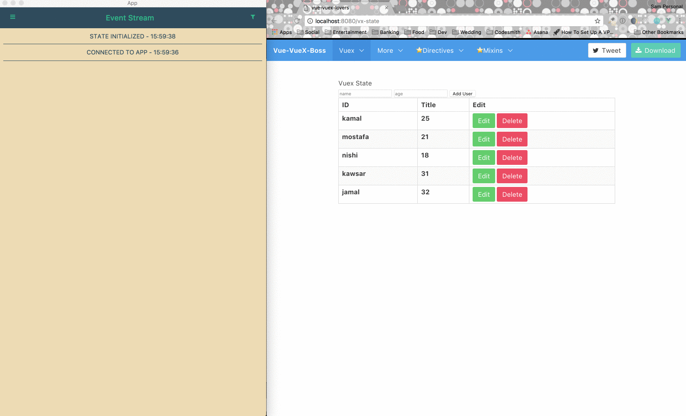
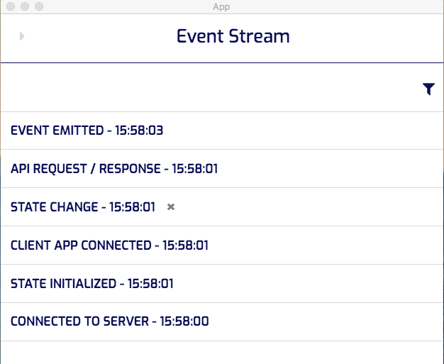
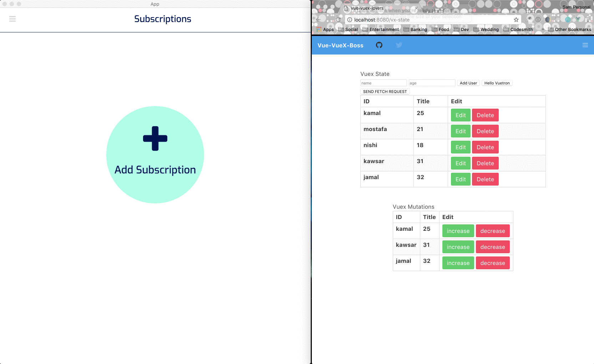
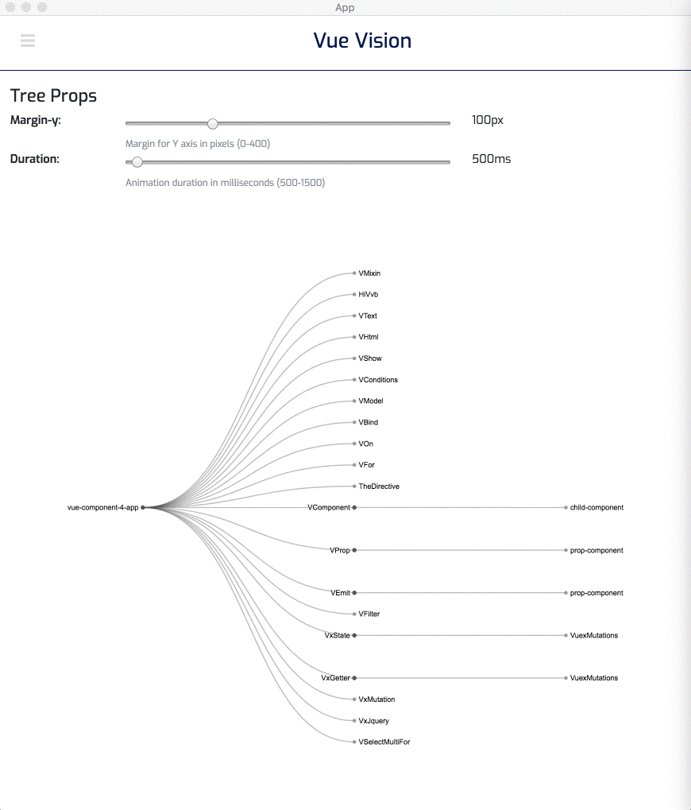
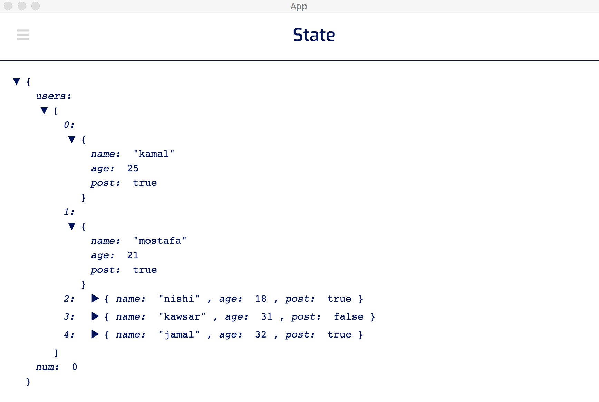

<h1 align="center">

<br>
Vuetron *NOT READY FOR DEPLOYMENT 
<a href="http://twitter.com/home?status=Check out Vuetron! Testing and debugging for Vue https://git.io/vFwOq"></a>
</h1>

<p align="center">A <a href="https://vuejs.org/" target="_blank">Vue</a> testing and debugging desktop app built on top of <a href="http://electron.atom.io" target="_blank">Electron</a>.</p>

<h4 align="center"><a href="https://google.com"></a>
<a href="https://travis-ci.org/talls-and-smalls/vuetron"></a>
<a href="https://www.npmjs.com/package/vuetron"></a>
<a href="https://standardjs.com/"></a>
<a href="https://github.com/talls-and-smalls/vuetron/blob/master/LICENSE.txt"></a>
<br/ >
<a href="https://codeclimate.com/github/talls-and-smalls/vuetron/maintainability"></a>
<a href="https://codeclimate.com/github/talls-and-smalls/vuetron/test_coverage"></a>
</h4>

## Getting Started

To use Vuetron, you will need both the desktop application and install the library in your Vue project.  You can find the app download and installation instructions .

## Key Features

#### Eventstream with Time Travel Debugging:
* Instantly time travel between previous application states, or revert a whole group of state changes at once.

<div align="center">
  
</div>

* See 5 types of events
  * Connected to Server: Vuetron has successfully connected to the socket server.
  * State Initialized: If using Vuex, this event is displayed when the initial state is received
    * This will reinitialize if your application is refreshed, but you will not lose previous state changes
  * State Change: If using Vuex, this event is displayed for each mutation call
    * The expanded card displays each state change that occurred
  * Event Emitted: This event is displayed for every $emit call
    * The expanded card displays the name of the $emit
  * API Request / Response: If using the fetch API for requests, this event is displayed for any request sent
    * The expanded card displays the request data as well as the response data

<div align="center">
  
</div>

#### State Subscriptions:
* Subscribe to specific parts of your application's state for faster debugging

<div align="center">
  
</div>

#### Component Tree:
* Visualizing your component hierarchy has never been easier.
  * Animation allows you to collapse or expand the tree for specific hierarchy views.

<div align="center">
  
</div>

#### Collapsable Vuex State Object:
* View and interact with an object representation of your application's most current state.

<div align="center">
  
</div>

#### Other benefits:
* GitHub Flavored Markdown
* Cross platform
  - Windows, Mac, and Linux ready.

## Running the tests

Explain how to run the automated tests for this system

### Break down into end to end tests

Explain what these tests test and why

```
Give an example
```

### And coding style tests

Explain what these tests test and why

```
Give an example
```

## Built With

* [Vue.js](https://vuejs.org/) - The web framework used
* [Vuex](https://vuex.vuejs.org/en/intro.html) - State Management
* [Vue-Router](https://router.vuejs.org/en/) - Routing
* [Electron](https://electron.atom.io/) - Used to build desktop app
* [Socket.io](https://socket.io/) - Used communicate between Vuetron and client's application

## Contributing

Found a bug? Have a suggestion? Feel free to submit issues!

Please read [CONTRIBUTING.md](CONTRIBUTING.md) for details on our code of conduct and the process for submitting pull requests if you're interesting in contributing to this project!

## Authors

* **Samantha Salley** - [https://github.com/samanthasalley](https://github.com/samanthasalley)

* **Louis Rouaze** - [https://github.com/louisrouaze](https://github.com/louisrouaze)

* **Kelly Gilliam** - [https://github.com/KellyGilliam](https://github.com/KellyGilliam)

* **Brandon Danh** - [https://github.com/brandondanh](https://github.com/brandondanh)

See also the list of [contributors](CONTRIBUTORS.md) who participated in this project.

## License

This project is licensed under the MIT License - see the [LICENSE.txt](LICENSE.txt) file for details

## Acknowledgments

* [vued3tree library](https://github.com/David-Desmaisons/Vue.D3.tree)
* [vue-object-view library](https://github.com/ebuzek/vue-object-view)
* Support from other open source developers
* And the entire Vue developer community
